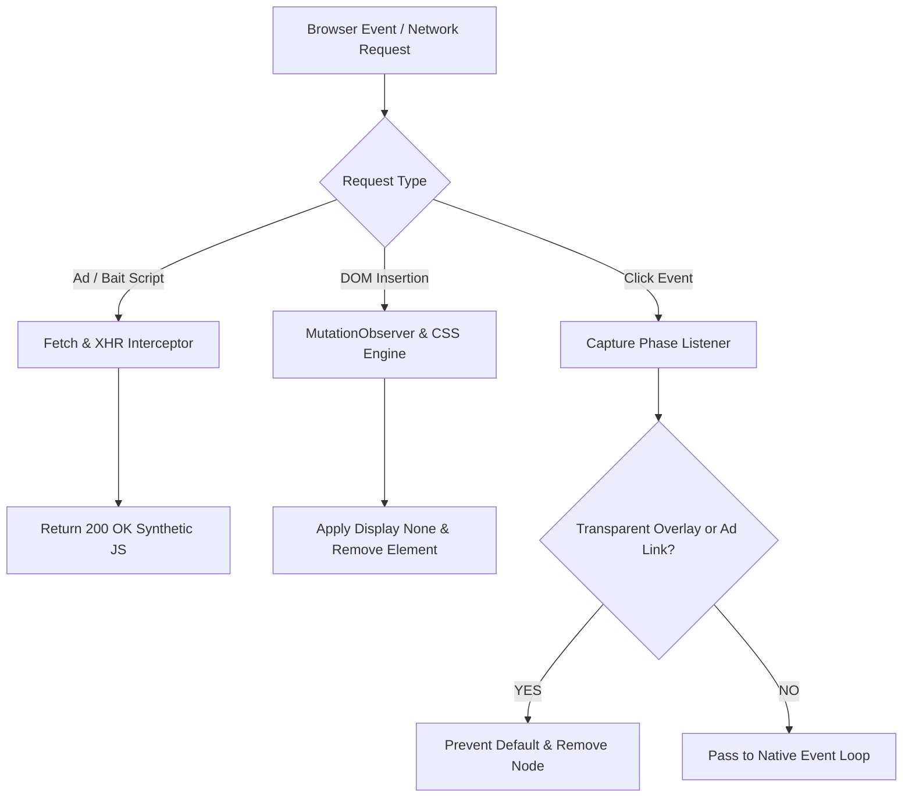

# Aggressive Ad, Pop-up & Anti-Adblock Shield

A standalone userscript that blocks intrusive banners, suppresses click-jacking pop-ups, defuses anti-adblock overlay walls, and removes search engine AI summaries. It operates completely independently from video playback logic to prevent media engine stutters.

---

## Features

* **Network Defusal:** Intercepts fetch and XHR calls to bait scripts and major ad domains, responding with clean code to satisfy host page dependencies.
* **Anti-Adblock Stubs:** Emulates standard objects for `adsbygoogle` and `googletag` so anti-adblock detectors believe ad scripts executed successfully.
* **Click-Jack & Pop-Up Interception:** Captures unprivileged click events, suppresses redirection parameters, and removes transparent fixed-position overlay traps.
* **Modal Neutralization:** Observes DOM changes to prune adblock warning walls and unlock scrolling by resetting page overflow styles.
* **Search Engine Optimization:** Enforces web mode parameter `udm=14` on Google Search and injects early CSS to hide AI overview cards.

---

## How It Works


---

## Configuration & Metadata

```javascript
// ==UserScript==
// @name         Aggressive Ad, Pop-up & Anti-Adblock Shield
// @namespace    local.shield.adandpopup
// @version      2.2.0
// @description  Strips embedded ads, blocks click-jack pop-ups, defuses anti-adblock modals, and cleans AI search boxes.
// @match        *://*/*
// @run-at       document-start
// @grant        none
// ==/UserScript==
```

---

## License

Distributed under the MIT License. Free for personal, educational, and open-source use.
